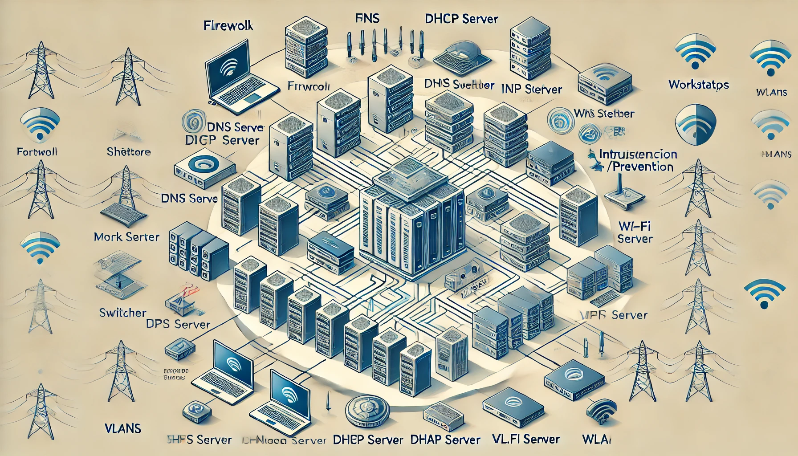

# 🏢 Corporate Network Design & Security Project

This project outlines the **design** and **implementation** of a **secure network** for a corporate environment. The goal is to build a **scalable**, **efficient**, and **highly secure** network infrastructure while addressing potential security risks through various layers of protection and controls.

## 📜 Table of Contents
1. [Project Overview](#project-overview)
2. [Network Architecture](#network-architecture)
3. [Key Features](#key-features)
4. [Setup and Configuration](#setup-and-configuration)
    1. [Router and Subnet Configuration](#router-and-subnet-configuration)
    2. [VLAN Setup](#vlan-setup)
    3. [DHCP and DNS Setup](#dhcp-and-dns-setup)
    4. [Firewall Setup](#firewall-setup)
    5. [Intrusion Detection and Prevention](#intrusion-detection-and-prevention)
    6. [VPN Setup](#vpn-setup)
5. [Security Best Practices](#security-best-practices)
6. [Network Monitoring](#network-monitoring)
7. [Testing and Validation](#testing-and-validation)
8. [Conclusion](#conclusion)

---

## 🌍 Project Overview

This project focuses on creating a **secure and efficient corporate network** using modern technologies and best practices. The network is segmented into various subnets for **internal users**, **guest users**, **public servers**, and **network management** to enhance **performance**, **security**, and **ease of management**.

### 🎯 Objectives:
- **Design a scalable and secure network architecture**.
- **Implement network segmentation** using VLANs and subnets.
- **Configure and harden critical services** like DNS, DHCP, and VPN.
- **Protect the network** using firewalls, IDS/IPS, and access control.
- **Monitor and manage** the network using industry-standard tools.

---

## 📊 Network Architecture

The designed network consists of multiple layers, each with distinct security controls to isolate and protect different areas of the organization. Below is a simplified and high-level diagram of the network.
#### Simplified diagram


#### High-level diagram


**Network Components**:
- **Core Router**: Connects all internal and external networks.
- **Firewall**: Controls traffic flow between network segments.
- **Switches with VLANs**: Provides network segmentation.
- **Servers**: DNS, DHCP, Web, and Database Servers.
- **VPN Gateway**: Secure remote access for employees.

### 🗂️ Network Segments:
1. **Internal Network (192.168.1.0/24)**: For company employees.
2. **DMZ (192.168.2.0/24)**: For public-facing services (e.g., web servers).
3. **Guest Network (192.168.3.0/24)**: Isolated network for guest users.
4. **Management Network (192.168.4.0/24)**: For managing devices and services.

---

## 🛠️ Key Features

1. **Segmentation with VLANs** to ensure isolation of different network areas.
2. **Firewall rules** to allow only necessary traffic between subnets.
3. **Intrusion Detection and Prevention** to monitor suspicious activities.
4. **VPN access** for secure remote connectivity.
5. **Access Control Lists (ACLs)** to manage traffic flow.
6. **Network Monitoring** for performance and security insights.

---

## ⚙️ Setup and Configuration

### 🌐 Router and Subnet Configuration
1. **Router**: Configure static routes and inter-VLAN routing to ensure proper communication between different subnets.
   ```bash
   interface GigabitEthernet0/0
      ip address 192.168.1.1 255.255.255.0
      no shutdown
   !
   interface GigabitEthernet0/1
      ip address 192.168.2.1 255.255.255.0
      no shutdown
   !
   ip route 0.0.0.0 0.0.0.0 203.0.113.1
   ```

2. **Subnetting**: Each department or network segment is assigned its own subnet.
   - **IT Department**: `192.168.1.0/24`
   - **Finance**: `192.168.1.128/25`
   - **HR**: `192.168.2.0/24`

### 🖧 VLAN Setup
- **Switch Configuration**: Set up VLANs for each department to ensure logical separation.
   ```bash
   vlan 10
      name IT
   vlan 20
      name Finance
   vlan 30
      name HR
   ```

   **VLAN Trunking**: Enable trunking to allow multiple VLAN traffic on a single port.
   ```bash
   interface GigabitEthernet1/1
      switchport mode trunk
   ```

### 📶 DHCP and DNS Setup
1. **DHCP Configuration**:
   - Configure the DHCP server for dynamic IP address assignment within each VLAN.
     ```bash
     ip dhcp pool IT_Pool
        network 192.168.1.0 255.255.255.0
        default-router 192.168.1.1
     ```

2. **DNS Setup**: 
   - Install and configure **Bind9** for internal name resolution.
   - Set up **forward and reverse zones** for internal domains (`corp.local`).
     ```bash
     zone "corp.local" {
         type master;
         file "/etc/bind/db.corp.local";
     };
     ```

### 🔥 Firewall Setup
- **Firewall Rules**:
   - Only allow **necessary traffic** such as HTTP/HTTPS to the DMZ.
   - Block all unnecessary traffic between internal VLANs to minimize attack surface.
   - Example firewall rule:
     ```bash
     allow ip from 192.168.1.0/24 to 192.168.2.0/24 port 80
     deny ip from 192.168.3.0/24 to any
     ```

### 🛡️ Intrusion Detection and Prevention
- **Install Snort/Suricata**: Set up Snort to detect and block suspicious traffic like port scans, brute force attacks, etc.
   ```bash
   snort -i eth0 -c /etc/snort/snort.conf
   ```

   - **Log Analysis**: Analyze intrusion detection logs regularly and update rules as needed.

### 🔐 VPN Setup
- **OpenVPN Configuration**:
   - Allow employees to securely access the internal network via a VPN.
   - Configure VPN to require **MFA** (multi-factor authentication) for additional security.

   ```bash
   port 1194
   proto udp
   dev tun
   ca ca.crt
   cert server.crt
   key server.key
   dh dh.pem
   ```

---

## 🔑 Security Best Practices

- **Network Segmentation**: Use VLANs and subnets to segment networks and minimize lateral movement during a potential breach.
- **Least Privilege**: Limit access to only necessary services and resources.
- **Access Control**: Apply ACLs on routers and firewalls to restrict traffic between different network segments.
- **Regular Security Audits**: Perform routine audits of firewall rules, IDS logs, and user access controls.

---

## 📡 Network Monitoring

- **Nagios/Zabbix**: Install **Nagios** or **Zabbix** to monitor network devices for uptime, bandwidth usage, and potential failures.
- **Syslog**: Centralize log collection using a **Syslog** server for firewall and network devices, enabling efficient monitoring and troubleshooting.

---

## 🧪 Testing and Validation

- **Penetration Testing**: Conduct tests using **Kali Linux** to verify firewall rules, test for open ports, and identify misconfigurations.
- **Connectivity Testing**: Test the network’s functionality using `ping`, `traceroute`, and `nslookup` between devices on different subnets.
- **VPN Validation**: Simulate a remote connection to the VPN and test access to internal resources.

---

## 🎯 Conclusion

This project outlines the implementation of a **secure and scalable network** that provides segmented, controlled access across multiple departments in a corporate environment. Following **best practices** and using a combination of **firewalls**, **VPNs**, **IDS/IPS**, and **monitoring tools**, this network is highly resilient against both internal and external threats.

🌟 **Happy Networking!** 🌟
