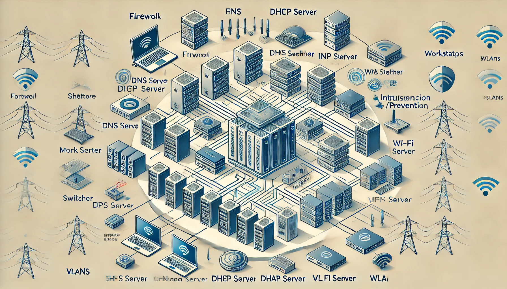
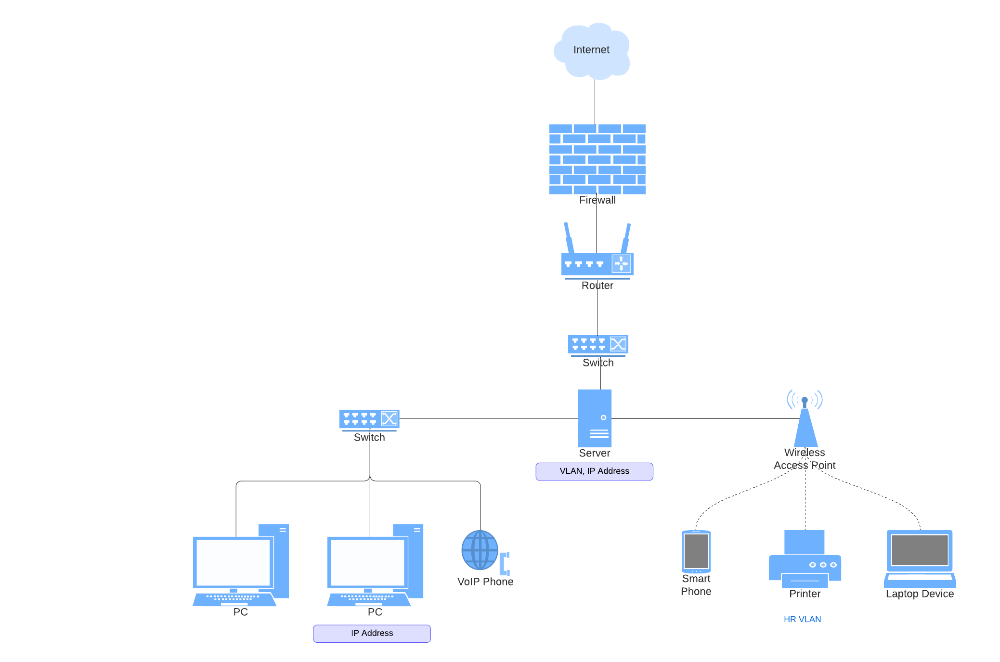

# Network Architecture Documentation: Detailed Report

### Network Diagram

### Simplified Network Diagram

---

### 1. Network Architecture Overview

**Purpose**:  
To design a **scalable** and **secure** network architecture for a corporate environment that ensures efficient traffic flow, security, and manageability. The architecture follows a layered approach, separating devices and services into core, distribution, and access layers for easier control and future scalability.

---

### 2. Network Design Components

**Key Components**:  
1. **Firewall**:  
   - **Purpose**: Acts as the first line of defense, protecting the network by filtering unauthorized traffic from external networks like the internet.  
   - **Functionality**: It uses rules to allow or deny traffic based on various factors like IP addresses, protocols, and ports.
   - **Type**: Next-Generation Firewalls (NGFW) with deep packet inspection and threat prevention features (anti-virus, anti-malware, etc.).

2. **Router**:  
   - **Purpose**: Manages traffic between internal VLANs and external networks (e.g., the internet).
   - **Functionality**: It forwards data packets between networks based on their IP addresses, enabling different departments or locations to communicate securely.
   - **Type**: Cisco/Juniper enterprise-grade routers.

3. **Switches**:  
   - **Purpose**: Facilitates communication between devices within the same VLAN or department.
   - **Functionality**: Switches operate at the data link layer (Layer 2), forwarding frames based on MAC addresses. Managed switches provide features like VLAN segmentation, Quality of Service (QoS), and port security.
   - **Type**: Layer 2 and Layer 3 switches from Cisco.

4. **Server**:  
   - **Purpose**: Centralized storage for services such as DNS, DHCP, and VPN servers.
   - **Functionality**: Provides essential network services to manage IP addresses (DHCP), resolve domain names (DNS), and handle secure remote connections (VPN).
   - **Type**: A dedicated Linux/Windows Server with role-specific software installed.

5. **Wireless Access Point (WAP)**:  
   - **Purpose**: Provides wireless connectivity for mobile devices such as laptops, smartphones, and tablets in the network.
   - **Functionality**: Allows wireless devices to access the LAN. WAPs are segmented by VLAN for security and performance management.
   - **Type**: Dual-band, enterprise-grade access points from Cisco/Aruba.

6. **VoIP Phone**:  
   - **Purpose**: Provides Voice over IP (VoIP) services to employees for business communication.
   - **Functionality**: VoIP converts voice into digital packets that are transmitted over the IP network. Managed under a dedicated VLAN for quality and security.
   - **Type**: Cisco/Polycom VoIP phones.

---

### 3. Network Segmentation: VLANs and Subnets

**Objective**:  
To **segment the network** into smaller broadcast domains for increased security and improved traffic management.

**VLAN Configuration**:  
VLANs separate departments and services to ensure isolation of network traffic. Each VLAN is assigned to a specific function or group of users in the organization:

- **VLAN 10** – Core Infrastructure (e.g., Servers and IT management devices)
- **VLAN 20** – HR Department
- **VLAN 30** – Finance Department
- **VLAN 40** – VoIP and Communication Systems
- **VLAN 50** – Wireless Devices

**Subnetting**:  
Each VLAN is assigned a distinct subnet to create a logical separation of traffic. Subnetting helps in improving security and reducing broadcast domain sizes. Example IP configurations are as follows:

- **VLAN 10**: 192.168.10.0/24 (Core)
- **VLAN 20**: 192.168.20.0/24 (HR)
- **VLAN 30**: 192.168.30.0/24 (Finance)
- **VLAN 40**: 192.168.40.0/24 (VoIP)
- **VLAN 50**: 192.168.50.0/24 (Wireless)

---

### 4. Configuration and Hardening of Critical Services

**DNS**:
- **Configuration**: Internal DNS is used for local name resolution, ensuring users can access resources by name rather than by IP address. Configured for DNS caching to improve performance.
- **Hardening**: 
  - **DNSSEC** is enabled to prevent DNS spoofing and ensure data integrity.
  - **Access Control Lists (ACLs)** restrict which devices can query the DNS server.

**DHCP**:
- **Configuration**: A centralized DHCP server automatically assigns IP addresses to devices within each VLAN. Different scopes are created for each VLAN’s IP range.
- **Hardening**:
  - **DHCP Snooping** is enabled to prevent rogue DHCP servers from distributing incorrect addresses.
  - IP leases are monitored for unusual activity, and strict lease times are enforced to avoid exhaustion of IP addresses.

**VPN**:
- **Configuration**: IPsec-based VPN is set up to allow secure remote access to internal resources.
- **Hardening**:
  - Only **strong encryption** (AES-256) and **multi-factor authentication (MFA)** are allowed for VPN access.
  - Split-tunneling is disabled to prevent internet traffic from bypassing corporate controls.

---

### 5. Network Security Measures

**Firewall Rules**:
- The firewall is configured with a **default-deny policy**, meaning all traffic is denied unless explicitly allowed.
- **Inbound Rules**:
  - Allow only traffic from trusted external sources (e.g., office branches) to access the internal network via secure protocols (e.g., HTTPS, IPsec VPN).
- **Outbound Rules**:
  - Restrict access to only required services (e.g., DNS, HTTP) for outbound internet connections.

**IDS/IPS**:
- **IDS** (Intrusion Detection System) is deployed to monitor the network for suspicious activity (e.g., port scanning, malware).
- **IPS** (Intrusion Prevention System) works in tandem with the IDS to block malicious traffic in real-time.

**Access Control**:
- Implement **Role-Based Access Control (RBAC)**: Access to critical resources is based on user roles, minimizing unauthorized access.
- **Network Access Control (NAC)**: Devices must comply with security policies (antivirus, firewall enabled) before connecting to the network.

---

### 6. Network Monitoring and Management

**Monitoring Tools**:  
Use tools like **Nagios** or **Zabbix** for real-time monitoring of network devices, services, and traffic. Key features include:

- **Bandwidth Monitoring**: Tracks network usage and identifies bottlenecks.
- **SNMP (Simple Network Management Protocol)**: Collects and organizes information about devices on the network.
- **Alerting System**: Immediate alerts via email or SMS if a service fails or if suspicious activity is detected.

**Management**:  
- **Scheduled Audits**: Regularly audit firewall rules, VLAN configurations, and security policies to ensure compliance with the organization's policies.
- **Penetration Testing**: Conduct periodic penetration tests to identify vulnerabilities in the network that attackers could exploit.

---

### 7. Conclusion and Summary

The corporate network is designed to be scalable, secure, and flexible, providing robust communication and resource access for all departments. Security is reinforced through segmentation (VLANs), encryption, and network policies such as firewall rules, IDS/IPS, and role-based access controls. Regular audits and monitoring ensure the network remains secure against evolving threats, while the modular design allows for easy expansion as the company grows.

---
